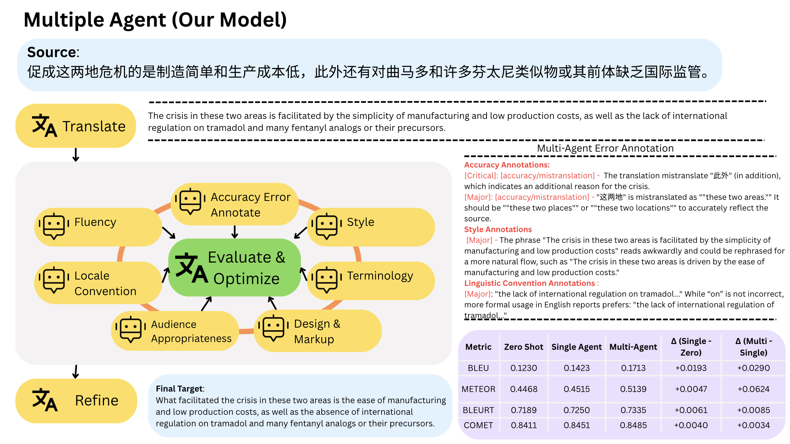

# MAATS: A Multi-Agent Automated Translation System Based on MQM



> MAATS breaks translation into modular steps—draft, multi-category error annotation, and synthesis—guided by the Multidimensional Quality Metrics (MQM) framework.

## 🔍 Overview

1. **Translator Agent**  
   Generates an initial draft.

2. **MQM Evaluator Agents**  
   Seven specialists flag errors in:
   - Accuracy  
   - Fluency  
   - Style  
   - Terminology  
   - Locale conventions  
   - Audience appropriateness  
   - Design & markup  

3. **Editor Agent**  
   Merges annotations by severity (Critical → Major → Minor) and produces a refined translation.

Tested on six language pairs with GPT-4o, Claude-3 and Gemini-2. MAATS shows clear gains in BLEU, METEOR, BLEURT, COMET and human rankings.


---

## 📂 Repository Structure

```

.
├── README.md                          ← this file
├── MAATS\_\_A\_Multi\_Agent\_…pdf          ← full paper
├── maats.png                          ← pipeline schematic
│
├── Prompts/                           ← few-shot prompts by MQM category
│   ├── accuracy.md
│   └── …
│
├── pipelines/                         ← runnable pipelines
│   ├── MAATS pipeline/                ← 9 modules
│   └── Single-Agent pipeline/         ← 2 modules
│
├── raw\_outputs\_by\_pair/               ← model outputs & annotations
│   └── \<LANG\_PAIR>/<MODEL>/\*
│
├── metric\_analysis/                   ← eval scripts & `summary_scores.csv`
│
├── human\_preferance\_analysis/         ← Flask app & vote data
│
└── MQM\_analysis/                      ← combined MQM annotations

````

---

## ⚙️ Installation

```bash
git clone https://github.com/maats0519/maats_mqm.git
cd maats_mqm
python3 -m venv .venv
source .venv/bin/activate
pip install -r requirements.txt
````

*(Or install: pandas, numpy, matplotlib, OpenAI/Anthropic client, Flask.)*

---

## 🚀 Quick Start

**MAATS pipeline**

```bash
cd pipelines/MAATS\ pipeline
python module1_zero-shot.py
python module2_terminology_annotation.py
…
python module9_translation_improvement.py
```

**Single-Agent baseline**

```bash
cd pipelines/Single-Agent\ pipeline
python module1_zero-shot.py
python module11_single_agent_annotation.py
python module12_single_agent_improvement.py
```

**Automatic metrics**

```bash
cd metric_analysis
python evaluate_bleu_meteor_comet.py
```

**Human ranking web app**

```bash
cd human_preferance_analysis/Website
FLASK_APP=app.py flask run
```

---

## 🤝 Contributing

1. Fork
2. Branch (`git checkout -b feature/…`)
3. Commit & push
4. Open a PR

Please include tests or evaluation snippets and update this README.

---

## 📜 License

Released under the **MIT License**. 

```
MIT License

Permission is hereby granted, free of charge, to any person obtaining a copy
of this software and associated documentation files (the “Software”), to deal
in the Software without restriction, including without limitation the rights
to use, copy, modify, merge, publish, distribute, sublicense, and/or sell      
copies of the Software, and to permit persons to whom the Software is          
furnished to do so, subject to the following conditions:                       

The above copyright notice and this permission notice shall be included in all 
copies or substantial portions of the Software.                                

THE SOFTWARE IS PROVIDED “AS IS”, WITHOUT WARRANTY OF ANY KIND, EXPRESS OR     
IMPLIED, INCLUDING BUT NOT LIMITED TO THE WARRANTIES OF MERCHANTABILITY,       
FITNESS FOR A PARTICULAR PURPOSE AND NONINFRINGEMENT. IN NO EVENT SHALL THE    
AUTHORS OR COPYRIGHT HOLDERS BE LIABLE FOR ANY CLAIM, DAMAGES OR OTHER         
LIABILITY, WHETHER IN AN ACTION OF CONTRACT, TORT OR OTHERWISE, ARISING FROM,  
OUT OF OR IN CONNECTION WITH THE SOFTWARE OR THE USE OR OTHER DEALINGS IN THE  
SOFTWARE.

```
